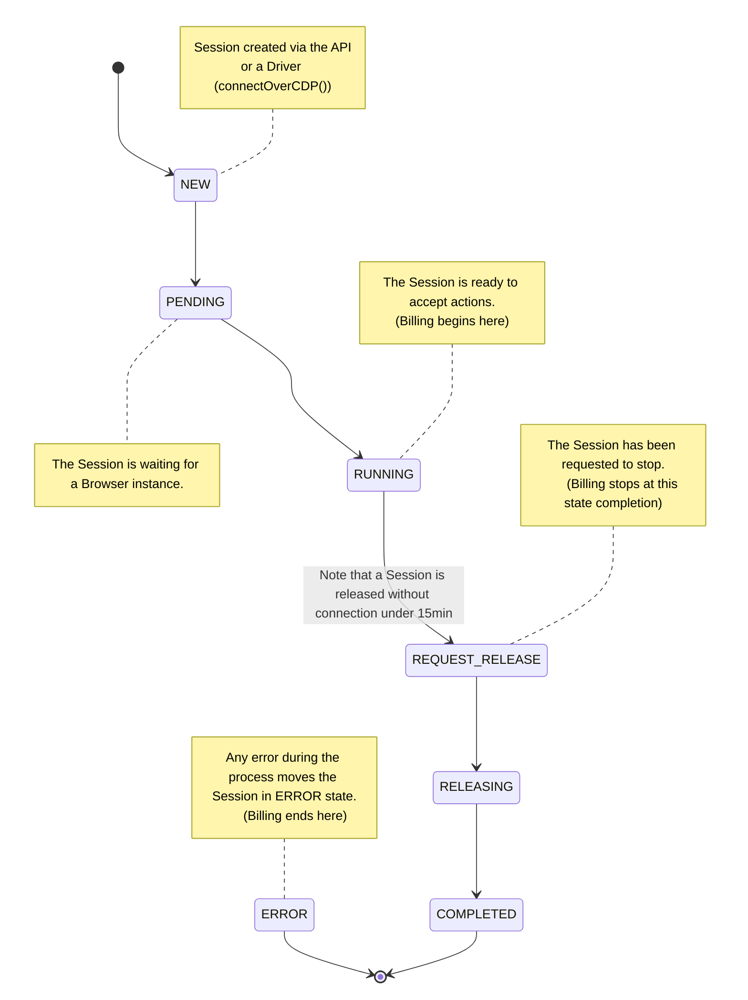

## Overview

A Session represents a single Browser run from the connection of a Browser
instance to its termination (closed, timeout, or disconnected).

### Starting a Session

A Session is either created on the fly, upon connection (via `connectOverCDP()`
or `puppeteer.connect()`), or via the
[Sessions API](/api-reference/list-all-sessions).

Once created, a Session can be connected to through a Driver (Playwright, Puppeteer, or
Selenium).

<CodeGroup>

```jsx Playwright (JavaScript)
import { chromium } from "playwright-core";
(async () => {
  const browser = await chromium.connectOverCDP(
    `wss://connect.browserbase.com?apiKey=${process.env.BROWSERBASE_API_KEY}`,
  );
  const defaultContext = browser.contexts()[0];
  const page = defaultContext.pages()[0];

  await page.goto("https://www.browserbase.com");

  await page.close();
  await browser.close();
})().catch((error) => console.error(error.message));
```

```jsx Puppeteer (JavaScript)
import puppeteer from "puppeteer-core";

(async () => {
  const browser = await puppeteer.connect({
    browserWSEndpoint: `wss://connect.browserbase.com?apiKey=${process.env.BROWSERBASE_API_KEY}`,
  });
  const page = await browser.newPage();

  await page.goto("https://www.browserbase.com");
  await page.close();
  await browser.close();
})().catch((error) => console.error(error.message));
```

```python Python
from playwright.sync_api import sync_playwright, Playwright

def run(playwright: Playwright):
    chromium = playwright.chromium
    browser = chromium.connect_over_cdp('wss://connect.browserbase.com?apiKey=${process.env.BROWSERBASE_API_KEY}')
    context = browser.contexts[0]
    page = context.pages[0]

with sync_playwright() as playwright:
    run(playwright)
```

</CodeGroup>

<Note>
  A Session created through the API must be connected in the first 15 minutes. Otherwise, it will move automatically to the `COMPLETED` state.
</Note>

### Session's lifecycle

A Session transitions through multiple states:



### Inspecting a Session

You can inspect a completed Session using the
[Session API](/api-reference/list-all-sessions) or the Dashboard:

| Action                                               | Browserbase Dashboard | Sessions API                                                |
| ---------------------------------------------------- | --------------------- | ----------------------------------------------------------- |
| Access logs                                          | ✅                    | [`GET /v1/sessions/[sessionid]/logs`](/api-reference/)      |
| Access ChromeDevTools data (ex: network, DOM events) | ✅                    | ❌                                                          |
| Access recording                                     | ✅                    | [`GET /v1/sessions/[sessionid]/recording`](/api-reference/) |
| Retrieve downloaded files                            | ❌                    | [`GET /v1/sessions/[sessionid]/downloads`](/api-reference/) |
| Access debug connection info                         | ❌                    | [`GET /v1/sessions/[sessionid]/debug`](/api-reference/)     |
| Access memory and CPUs usage                         | ✅                    | ❌                                                          |

## Limitations

- Sessions have a default timeout of 30min. As a customer, reach out to us on
  Slack to increase this limit.
- Disconnecting from your browser moves the session's state to `COMPLETED,`
  which cannot be reconnected.

## Patterns

### Persist the Session ID in your database

You may want to save the session ID of your browser session in your database.
That's a simple two-step process

1. Use the [Session API](/api-reference/create-a-session) to create a new
   session.
2. Add the `&sessionId=${sessionId}` query parameter to your connection string.

The resulting string should look something like this:

`wss://connect.browserbase.com?apiKey=${process.env.BROWSERBASE_API_KEY}&sessionId=${sessionId}`

### Downloading files

A typical workflow for using headless browsers includes downloading files from
web pages. Our browsers are configured to sync any file you download to our
storage infrastructure.

Follow the steps to download files:

1. Use the
   [Create Session API](https://www.notion.so/Getting-Started-Guide-132ce877353a4b4fa051fa1de5d7981b?pvs=21)
   to create a new session. You'll need the session ID for when you connect.

2. Finally, configure your library's downloads location:

<CodeGroup>

```jsx Playwright
import { chromium } from "playwright-core"
import { writeFileSync } from "node:fs"

async function saveDownloadsOnDisk(sessionId: string, retryForSeconds: number) {
    return new Promise((resolve, reject) => {
        let pooler;
        const timeout = setTimeout(() => {
            if (pooler) {
              clearInterval(pooler)
            }
        }, retryForSeconds);
        function fetchDownloads() {
            try {
              const response = await fetch(
                `https://www.browserbase.com/v1/sessions/${sessionId}/downloads`, {
                  method: 'GET',
                  headers: {
                    Authorization: `x-bb-api-key: ${process.env.BROWSERBASE_API_KEY}`
                  }
              });
              const arrayBuffer = await response.arrayBuffer()
              if (arrayBuffer.bytesLength > 0) {
                const buffer = Buffer.from(arrayBuffer)
                writeFileSync('downloads.zip', buffer)
                clearInterval(pooler)
                clearTimeout(timeout)
                resolve()
              }
            } catch (e) {
              clearInterval(pooler)
              clearTimeout(timeout)
              reject(e)
            }
        }
        pooler = setInterval(fetchDownloads, 2000)
    })
}

(async () => {
  // `createSession()` performs a call to the Browserbase Session API
  const { id: sessionId } = await createSession();
  const browser = await chromium.connectOverCDP(
    // we connect to a Session created via the API
    `wss://connect.browserbase.com?apiKey=${process.env.BROWSERBASE_API_KEY}&sessionId=${sessionId}`
  );
  const defaultContext = browser.contexts()[0];
  const page = defaultContext.pages()[0];

  // Required to avoid playwright overriding location
  const client = await defaultContext.newCDPSession(page);
  await client.send("Page.setDownloadBehavior", {
    behavior: "allow",
    downloadPath: "/home/browser/downloads",
    //@ts-ignore
    eventsEnabled: true,
  });

  await page.goto("https://browser-tests-alpha.vercel.app/api/download-test");

  const [download] = await Promise.all([
    page.waitForEvent("download"),
    page.locator("#download").click(),
  ]);

  let downloadError = await download.failure();
  if (downloadError !== null) {
    console.log("Error happened on download:", downloadError);
    throw new Error(downloadError);
  }

  await page.close();
  await browser.close();

  if (!downloadError) {
    // wait up to 20s to save the downloaded files locally
    await saveDownloadsOnDisk(sessionId, 20000)
  }
})().catch((error) => console.error(error.message));
```

```jsx Puppeteer
import puppeteer from "puppeteer-core"
import { writeFileSync } from "node:fs"

async function saveDownloadsOnDisk(sessionId: string, retryForSeconds: number) {
    return new Promise((resolve, reject) => {
        let pooler;
        const timeout = setTimeout(() => {
            if (pooler) {
              clearInterval(pooler)
            }
        }, retryForSeconds);
        function fetchDownloads() {
            try {
              const response = await fetch(
                `https://www.browserbase.com/v1/sessions/${sessionId}/downloads`, {
                  method: 'GET',
                  headers: {
                    Authorization: `x-bb-api-key: ${process.env.BROWSERBASE_API_KEY}`
                  }
              });
              const arrayBuffer = await response.arrayBuffer()
              if (arrayBuffer.bytesLength > 0) {
                const buffer = Buffer.from(arrayBuffer)
                writeFileSync('downloads.zip', buffer)
                clearInterval(pooler)
                clearTimeout(timeout)
                resolve()
              }
            } catch (e) {
              clearInterval(pooler)
              clearTimeout(timeout)
              reject(e)
            }
        }
        pooler = setInterval(fetchDownloads, 2000)
    })
}

(async () => {
  // `createSession()` performs a call to the Browserbase Session API
  const { id: sessionId } = await createSession();
	const browser = await puppeteer.connect({
    // we connect to a Session created via the API
    browserWSEndpoint:
    `wss://connect.browserbase.com?apiKey=${process.env.BROWSERBASE_API_KEY}&sessionId=${sessionId}`
  });
  const page = await browser.newPage();

  const client = await page.createCDPSession();
	await client.send("Page.setDownloadBehavior", {
    behavior: "allow",
    downloadPath: "/home/browser/downloads",
    //@ts-ignore
    eventsEnabled: true,
  });

  await page.goto("https://www.browserbase.com");
  await page.close();
  await browser.close();

  // wait up to 20s to save the downloaded files locally
  await saveDownloadsOnDisk(sessionId, 20000)
})().catch((error) => console.error(error.message));
```

</CodeGroup>

_Selenium support is in beta. Please reach out to have it enabled on your
account._

<Info>

We sync the files in real time; the size of your downloads might affect their
immediate availability through the `/downloads` endpoint. The above code
provides a snippet to handle that use case.

</Info>
