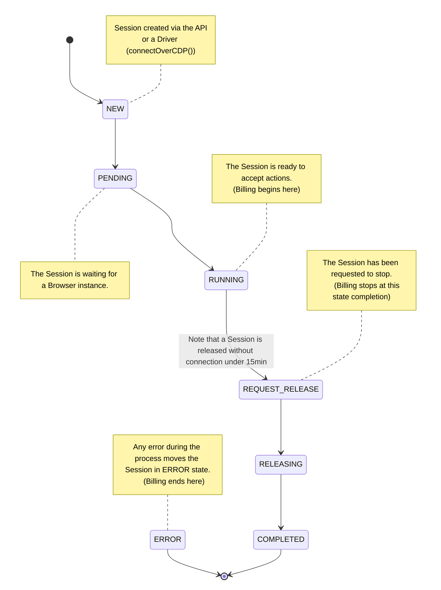

## Overview

A Session represents a single Browser run from the connection of a Browser
instance to its termination (closed, timeout, or disconnected).

### Starting a Session

A Session is either created on the fly, upon connection (via `connectOverCDP()`
or `puppeteer.connect()`), or via the
[Sessions API](/api-reference/create-a-session).

Once created, a Session can be connected to through a Driver (Playwright,
Puppeteer, or Selenium) or via
[Remote Control](guides/session-debug-connection/overview).

<CodeGroup>

```jsx Playwright (JavaScript)
import { chromium } from "playwright-core";
(async () => {
  const browser = await chromium.connectOverCDP(
    `wss://connect.browserbase.com?apiKey=${process.env.BROWSERBASE_API_KEY}`,
  );
  const defaultContext = browser.contexts()[0];
  const page = defaultContext.pages()[0];

  await page.goto("https://www.browserbase.com");

  await page.close();
  await browser.close();
})().catch((error) => console.error(error.message));
```

```jsx Puppeteer (JavaScript)
import puppeteer from "puppeteer-core";

(async () => {
  const browser = await puppeteer.connect({
    browserWSEndpoint: `wss://connect.browserbase.com?apiKey=${process.env.BROWSERBASE_API_KEY}`,
  });
  const page = await browser.newPage();

  await page.goto("https://www.browserbase.com");
  await page.close();
  await browser.close();
})().catch((error) => console.error(error.message));
```

```python Playwright (Python)
from playwright.sync_api import sync_playwright, Playwright

def run(playwright: Playwright):
    chromium = playwright.chromium
    browser = chromium.connect_over_cdp('wss://connect.browserbase.com?apiKey=${process.env.BROWSERBASE_API_KEY}')
    context = browser.contexts[0]
    page = context.pages[0]

with sync_playwright() as playwright:
    run(playwright)
```

```python Selenium (Python)
from selenium import webdriver
from selenium.webdriver.remote.remote_connection import RemoteConnection
from selenium.webdriver.common.desired_capabilities import DesiredCapabilities
import requests
import os

def create_session():
    url = 'https://www.browserbase.com/v1/sessions'
    headers = {'Content-Type': 'application/json', 'x-bb-api-key': os.environ["BROWSERBASE_API_KEY"]}
    json = {
        "projectId": os.environ["BROWSERBASE_PROJECT_ID"],
        # Fingerprint options
        "fingerprint": {
            "locales": ["en", "en-US", "de"],
            "operatingSystems": ["android"]
        }
    }
    response = requests.post(url, json=json, headers=headers)
    return response.json()['id']


class CustomRemoteConnection(RemoteConnection):
    _session_id = None

    def __init__(self, remote_server_addr: str, session_id: str):
        super().__init__(remote_server_addr)
        self._session_id = session_id

    def get_remote_connection_headers(self, parsed_url, keep_alive=False):
        headers = super().get_remote_connection_headers(parsed_url, keep_alive)
        headers.update({'x-bb-api-key': os.environ["BROWSERBASE_API_KEY"]})
        headers.update({'session-id': self._session_id})
        return headers


def run():
    session_id = create_session()
    custom_conn = CustomRemoteConnection('http://connect.browserbase.com/webdriver', session_id)
    options = webdriver.ChromeOptions()
    options.debugger_address = "localhost:9223"
    driver = webdriver.Remote(custom_conn, options=options)
    driver.get("https://www.browserbase.com")
    get_title = driver.title
    print(get_title)
    # Make sure to quit the driver so your session is ended!
    driver.quit()

run()
```

</CodeGroup>

<Note>
  A Session created through the API must be connected in the first 15 minutes.
  Otherwise, it will move automatically to the `COMPLETED` state.
</Note>

### Session's lifecycle

A Session transitions through multiple states:



### Inspecting a Session

You can inspect a completed Session using the
[Session API](/api-reference/retrieve-a-session) or the
[Session Debugger](/features/session-debugger):

| Action                                               | Session Debugger | Sessions API                                                |
| ---------------------------------------------------- | ---------------- | ----------------------------------------------------------- |
| Access logs                                          | ✅               | [`GET /v1/sessions/[sessionid]/logs`](/api-reference/)      |
| Access ChromeDevTools data (ex: network, DOM events) | ✅               | ❌                                                          |
| Access recording                                     | ✅               | [`GET /v1/sessions/[sessionid]/recording`](/api-reference/) |
| Retrieve downloaded files                            | ❌               | [`GET /v1/sessions/[sessionid]/downloads`](/api-reference/) |
| Access debug connection info                         | ❌               | [`GET /v1/sessions/[sessionid]/debug`](/api-reference/)     |
| Access memory and CPUs usage                         | ✅               | ❌                                                          |

## Limitations

- Sessions have a default timeout of 30min. As a customer, reach out to us on
  Slack to increase this limit.
- Disconnecting from a browser moves the session's state to `COMPLETED`, which
  cannot be reconnected.
