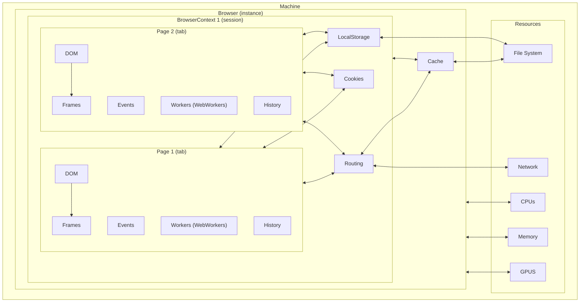

Most drivers (Playwright, Puppeteer) expose an API through `Browser`,
`BrowserContext`, and `Page` objects.

The boundaries between them can be blurry. This guide teaches you to avoid
common pitfalls and how each concept relates to Browserbase's architecture.

## What are BrowserContexts and Pages?

A typical Playwright or Puppeteer program looks as follows:

 <CodeGroup>

    ```javascript Playwright (JavaScript)
    import { chromium } from "playwright-core";

    (async () => {
      // 1. Get a Browser instance
      const browser = await chromium.connectOverCDP(
        `wss://connect.browserbase.com?apiKey=${process.env.BROWSERBASE_API_KEY}`
      );

      // 2. Get a BrowserContext
      const defaultContext = browser.contexts()[0];
      // 3. Get a Page
      const page = defaultContext.pages()[0];

      // 4. Act on Page
      await page.goto("https://browserbase.com/");
      await page.close();
      await browser.close();
    })().catch((error) => console.error(error.message));
    ```

    ```javascript Puppeteer (JavaScript)
    import puppeteer from "puppeteer-core";

    (async () => {
      // 1. Get a Browser instance
      const browser = await puppeteer.connect({
        browserWSEndpoint:
        `wss://connect.browserbase.com?apiKey=${process.env.BROWSERBASE_API_KEY}`
      });

      // 2. Get a Page
      const page = await browser.newPage();

      // 3. Act on Page
      await page.goto("https://www.browserbase.com");
      await page.close();
      await browser.close();
    })().catch((error) => console.error(error.message));
    ```

    ```python Python
    from playwright.sync_api import sync_playwright, Playwright

    def run(playwright: Playwright):
        chromium = playwright.chromium
        # 1. Get a Browser instance
        browser = chromium.connect_over_cdp('wss://connect.browserbase.com?apiKey=${process.env.BROWSERBASE_API_KEY}')
        # 2. Get a BrowserContext
        context = browser.contexts[0]
        # 3. Get a Page
        page = context.pages[0]

        # 4. Act on Page

        # ...

    with sync_playwright() as playwright:
        run(playwright)
    ```

    </CodeGroup>

Let's look at the `Browser`, `BrowserContext`, and `Page` definitions by
comparing them to our day-to-day Browser:

| Concept          | Drive (Puppeteer/Playwright)                                   | My Browser                                           |
| ---------------- | -------------------------------------------------------------- | ---------------------------------------------------- |
| `Browser`        | A Browser instance (_dedicated cache, sessions_)               | The running Chrome application                       |
| `BrowserContext` | A Browser Session (_dedicated cookies, shared cache_)          | Browser Window or Chrome Profile or Incognito Window |
| `Page`           | A Browser tab (_dedicated history, shared cookies, and cache_) | Tabs                                                 |

We can now visualize the relationship between them as follows:



`Browser`, `BrowserContext`, and `Page` are encapsulated concepts that enable
developers to control different parts of the Browser.

Browserbase removes the complexity of dealing with multiple `BrowserContext` by
offering on-the-fly browsers with a unique context in which to interact.

## How to use BrowserContexts and Pages with Browserbase

Browserbase assigns each `Browser` to a
[dedicated virtual machine](/under-the-hood) (with isolated resources -- unlike
your local browser) with a unique `BrowserContext` leveraging the
[Persistent Context API](https://playwright.dev/docs/api/class-browsertype#browser-type-launch-persistent-context).

The combination of isolated resources and a unique `BrowserContext`
[enables the support for Chrome Extensions](/features/browsers#loading-a-custom-extension)
and reliable performances.

In short, with Browserbase:

> A Browser Session (`connectOverCDP()`) = Dedicated Browser + Unique
> BrowserContext

<br />

Here are some dos and don'ts to help get the best out of Browserbase:

### Dos

<AccordionGroup>

<Accordion title="Always grab the first Page and BrowserContext" defaultOpen>
  <CodeGroup>

    ```javascript Playwright (JavaScript)
    import { chromium } from "playwright-core";

    (async () => {
      const browser = await chromium.connectOverCDP(
        `wss://connect.browserbase.com?apiKey=${process.env.BROWSERBASE_API_KEY}`
      );

      // Make sure to grab the first BrowserContext and Page
      const defaultContext = browser.contexts()[0];
      const page = defaultContext.pages()[0];

      // Act on Page
      await page.goto("https://browserbase.com/");
      await page.close();
      await browser.close();
    })().catch((error) => console.error(error.message));
    ```

    ```javascript Puppeteer (JavaScript)
    import puppeteer from "puppeteer-core";

    (async () => {
      const browser = await puppeteer.connect({
        browserWSEndpoint:
        `wss://connect.browserbase.com?apiKey=${process.env.BROWSERBASE_API_KEY}`
      });
      // Make sure to grab the first Page
      const page = await browser.newPage();

      // Act on Page
      await page.goto("https://www.browserbase.com");
      await page.close();
      await browser.close();
    })().catch((error) => console.error(error.message));
    ```

    ```python Python
    from playwright.sync_api import sync_playwright, Playwright

    def run(playwright: Playwright):
        chromium = playwright.chromium
        browser = chromium.connect_over_cdp('wss://connect.browserbase.com?apiKey=${process.env.BROWSERBASE_API_KEY}')
        # Make sure to grab the first BrowserContext and Page
        context = browser.contexts[0]
        page = context.pages[0]

        # Act on Page

        # ...

    with sync_playwright() as playwright:
        run(playwright)
    ```
    </CodeGroup>

</Accordion>

<Accordion title="Create multiple Browser instances for parallelization">
  <Card
    title="Follow the complete guide on Parallelization"
    icon="book"
    iconType="light"
    href="/guides/parallelization"
  >
    See how to setup multiple Browser instances to speed up your Automation.
  </Card>
</Accordion>

</AccordionGroup>

### Don'ts

<AccordionGroup>

<Accordion title="Don't use multiple BrowserContexts or Pages to speed up your automation" defaultOpen>
  Using multiple contexts or pages breaks the Session recording and live debugger URLs. **Instead, [rely on multiple browser instances](/guides/parallelization)**.

```javascript Playwright (JavaScript)
import { chromium } from "playwright-core";

(async () => {
  const browser = await chromium.connectOverCDP(
    `wss://connect.browserbase.com?apiKey=${process.env.BROWSERBASE_API_KEY}`,
  );

  const getContent = async (url) => {
    const context = await browser.newContext();
    const page = await context.newPage();

    try {
      await page.goto(url, {
        waitUntil: "domcontentloaded",
      });

      return await page.content();
    } finally {
      await page.close();
    }
  };

  await Promise.all(
    ["https://www.google.com", "https://www.bing.com"].map(async (item) => {
      const contents = [];

      for (url in item.urls) {
        contents.push(await getContent(url));
      }

      return contents;
    }),
  );
  await browser.close();
})().catch((error) => console.error(error.message));
```

</Accordion>

<Accordion title="Don't use multiple Pages to reuse cookies or localStorage across multiple scenarios">

Using multiple pages breaks the Session recording and live debugger URLs.
**Instead, reuse the default context and page**.

```javascript Playwright (JavaScript)
import { chromium } from "playwright-core";

(async () => {
  const browser = await chromium.connectOverCDP(
    `wss://connect.browserbase.com?apiKey=${process.env.BROWSERBASE_API_KEY}`,
  );

  const context = await browser.contexts()[0];

  const page = await context.newPage();

  await page.goto("https://www.browserbase.com/sign-in", {
    waitUntil: "domcontentloaded",
  });

  await page.close();

  // sign in ...

  const page = await context.newPage();

  await page.goto("https://www.browserbase.com/playground", {
    waitUntil: "domcontentloaded",
  });

  // interact with a clean playground while authenticated

  await page.close();
  await browser.close();
})().catch((error) => console.error(error.message));
```

</Accordion>

</AccordionGroup>
