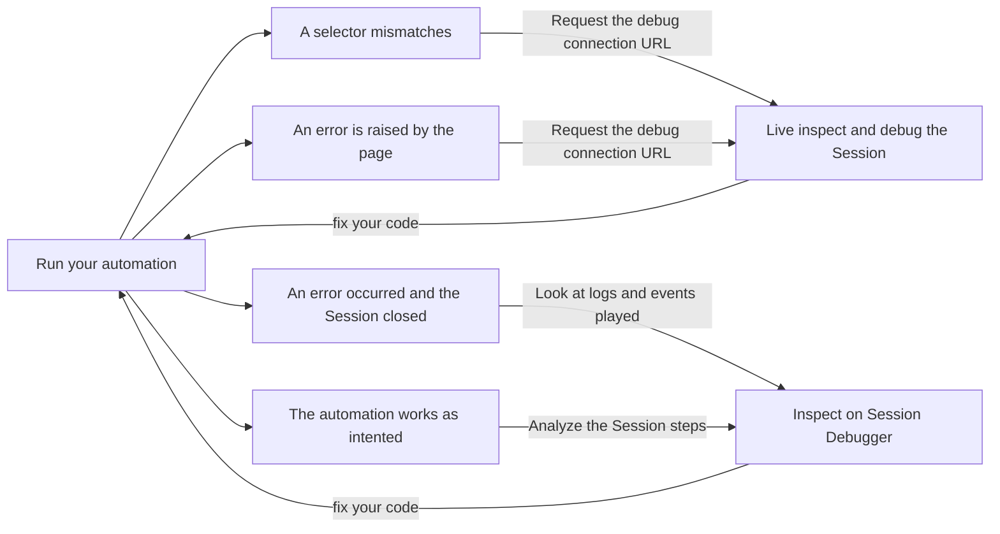

This guide covers getting a `debuggerFullscreenUrl` to access a running Session
to debug a local AI Agent iteration or handle complex UI scenarios such as
dealing with iframes or user credentials.


## Unblock complex UI scenarios by giving control to the end-user

While Browserbase helps deal with common scraping problems
([anti-bot mechanism, captchas](/features/stealth-mode),
[reliably download files](/features/sessions#downloading-files)), some scenarios
remain hard to automate for technical or data privacy reasons.

**Dealing with iframe** can be challenging as the loaded content might be
external and could change without notice, adding another fold of scraping
complexity. Interacting with iframes can be delegated to the end user by
forwarding the remote control URL.

**Dealing with user credentials** is another complex scenario as the end-user
might prefer to fill out its credentials directly on the website instead of
storing them elsewhere.

Let's look at the last scenario with an AI Agent for Amazon wishlists.

### Pause our automation while the user enters its credentials

Our AI Agent tries to find the best prices for items on a user's Amazon
wishlist; below is the `retrieveAmazonWishlistItems()` function responsible to
gather the items:

```js
async function retrieveDebugConnectionURL(sessionId) {
  const response = await fetch(
    `https://www.browserbase.com/v1/sessions/${sessionId}/debug`,
    {
      method: "GET",
      headers: {
        'x-bb-api-key': `${process.env.BROWSERBASE_API_KEY}`,
      },
    }
  );
  const json = await response.json();
  return json.debuggerFullscreenUrl;
}

async function retrieveAmazonWishlistItems(sessionId, page) {
  await page.goto(
    `https://www.amazon.com/ap/signin?openid.pape.max_auth_age=0&openid.return_to=https%3A%2F%2Fwww.amazon.com%2F%3Fref_%3Dnav_signin&openid.identity=http%3A%2F%2Fspecs.openid.net%2Fauth%2F2.0%2Fidentifier_select&openid.assoc_handle=usflex&openid.mode=checkid_setup&openid.claimed_id=http%3A%2F%2Fspecs.openid.net%2Fauth%2F2.0%2Fidentifier_select&openid.ns=http%3A%2F%2Fspecs.openid.net%2Fauth%2F2.0`,
    {
      // let's make sure the page is fully loaded before asking for the live debug URL
      waitUntil: "domcontentloaded",
    }
  );

  const debugRemoteURL = await retrieveDebugConnectionURL(sessionId)

  await sendCredentialsPageUrlToUser(debugRemoteURL)

  // now, let's wait for the user to complete the credential flow

  await page.waitForSelector('#nav-flyout-wl-items > div > a:nth-child(2) > span', {
    timeout: 300000 // give 5 minutes,
    visible: false
  })

  // Once we are here:
  // 1. navigate to https://www.amazon.com/hz/wishlist/ls
  // 2. collect items and navigates pagination
}
```

## Accelerate your local development with remote debugging

Developing scraping programs requires a lot of slow iterations, involving lots
of `console.log()` and `page.on('pageerror', /* ... */`.

Fortunately, you can develop new automation or AI Agent 10x faster by combining
the live debugging of Sessions and
[Session Debugger](/features/session-debugger):



Let's see how to implement this local development workflow:

```js
import { chromium } from "playwright-core";

let sessionId;

async function createSession() {
  const response = await fetch(`https://www.browserbase.com/v1/sessions`, {
    method: "POST",
    headers: {
      "x-bb-api-key": `${process.env.BROWSERBASE_API_KEY}`,
      "Content-Type": "application/json",
    },
    body: JSON.stringify({
      projectId: process.env.BROWSERBASE_PROJECT_ID,
    }),
  });
  const json = await response.json();
  return json;
}

async function retrieveDebugConnectionURL(sessionId) {
  const response = await fetch(
    `https://www.browserbase.com/v1/sessions/${sessionId}/debug`,
    {
      method: "GET",
      headers: {
        "x-bb-api-key": `${process.env.BROWSERBASE_API_KEY}`,
      },
    },
  );
  const json = await response.json();
  return json.debuggerFullscreenUrl;
}

(async () => {
  const { id } = await createSession();
  sessionId = id;
  const browser = await chromium.connectOverCDP(
    // we connect to a Session created via the API
    `wss://connect.browserbase.com?apiKey=${process.env.BROWSERBASE_API_KEY}&sessionId=${sessionId}`,
  );
  const defaultContext = browser.contexts()[0];
  const page = defaultContext.pages()[0];

  await page.goto("https://www.browserbase.com", {
    // let's make sure the page is fully loaded before asking for the live debug URL
    waitUntil: "domcontentloaded",
  });

  const debugUrl = await retrieveDebugConnectionURL(sessionId);
  console.log(`Session started, live debug accessible here: ${debugUrl}.`);

  await page.close();
  await browser.close();
})().catch((error) => {
  console.log(
    `Session failed, replay is accessible here: https://www.browserbase.com/sessions/${sessionId}.`,
  );
  console.error(error.message);
});
```

Let's review the key snippets used:

<Steps>

<Step title="The createSession() and retrieveDebugConnectionURL() helper">
  Keep these two helpers close by mutualizing them into an `utils.js` file.
</Step>

<Step title="Printing the debug connection URL as soon as the Session is ready">
  Retrieve and print the debug connection URL as soon as the Session starts,
  making it accessible in case of a stuck Session or unexpected errors.
</Step>

<Step title="Print out the Session Debugger link in case of failure">
  Finally, we close the loop of productivity by printing the direct link to the
  [Session Debugger](/features/session-debugger) in case of a Session crash.
</Step>

</Steps>
