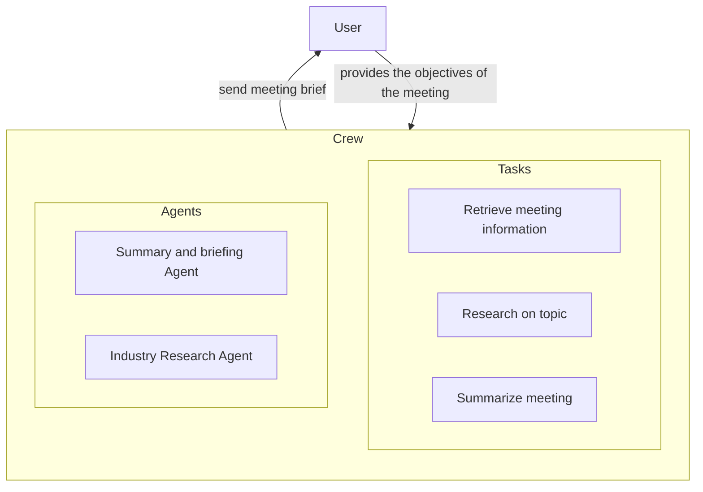

## Introduction

LLM enables various use cases, one of the most advanced of them being Agents, programs designed to perform a set of tasks based on high-level instructions.

[CrewAI](https://www.crewai.com/) is a framework to create Crews, teams of Agents working together on a given problem, for example:
- [Trip Planner Crew](https://github.com/joaomdmoura/crewAI-examples/tree/main/trip_planner)
- [Prepare for meetings](https://github.com/joaomdmoura/crewAI-examples/tree/main/prep-for-a-meeting)
- [Instagram Marketing Crew](https://github.com/joaomdmoura/crewAI-examples/tree/main/instagram_post)

To achieve such results AI Agents rely on a set of tools to gather rich contexts and perform actions:

Browserbase provides a [BrowserbaseLoadTool](https://docs.crewai.com/tools/BrowserbaseLoadTool/) that Agents can use to retrieve context from complex webpages such as:
- Extract text from webpages using JavaScript or anti-bot mechanisms
- Capture Images from webpages

## Add Browserbase to your CrewAI's Agents

<Card
title="Enable your CrewAI Agent to browse the web like humans"
icon="book"
iconType="light"
href="/integrations/crew-ai/python"
>
Configure `BrowserbaseLoadTool` for your Agents.
</Card>