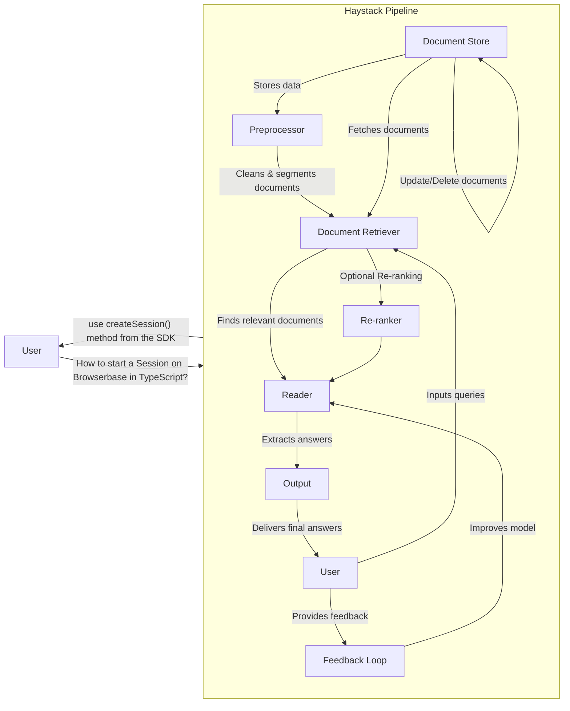

## Introduction

Haystack is a framework for building enterprise-grade LLM pipelines with a wide range of [Pipeline Components](https://docs.haystack.deepset.ai/docs/components)
to provide rich answers on large and heterogeneous document sets.

Browserbase provides a `BrowserbaseFetcher`, enabling the retrieval of data from JavaScript-powered web pages or websites with anti-bots mechanisms.

## Add Browserbase to your Haystack Pipeline

<Card
title="Fetch rich webpages within your Haystack pipeline"
icon="book"
iconType="light"
href="/integrations/haystack/python"
>
Configure `BrowserbaseFetcher` for your Pipeline.
</Card>