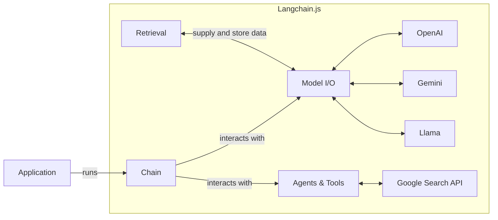

## Introduction

[Langchain.js](https://js.langchain.com/docs/get_started/introduction) is a framework to build applications on top of Large-Language Models (OpenAI, Llama, Gemeni).

Building on top of LLMs comes with many challenges:
- Gathering and preparing the data (context) and providing memory to models
- Orchestrating tasks to match LLM API requirements (ex: rate limiting, chunking)
- Parse the different LLM result format

Langchain comes with a set of high-level concepts and tools to cope with those challenges:
- [Retrieval modules](https://js.langchain.com/docs/modules/data_connection/data_connection/) such as [Document Loaders](https://js.langchain.com/docs/modules/data_connection/document_loaders/) or [Text splitter](https://js.langchain.com/docs/modules/data_connection/document_transformers/) help with gathering and preparing the data provided to the models
- [Model I/O](https://js.langchain.com/docs/modules/model_io/) is a set of tools that help to normalize the APIs across multiple models (_ex: Prompt Templates_)
- [Agents](https://js.langchain.com/docs/modules/agents/) and Tools help to build reasoning (_ex: how to answer based on provided context, what actions to take_)
- [Chains](https://js.langchain.com/docs/modules/chains/) help in orchestrating all the above

Browserbase provides a `Document Loader` to enable your Langchain application to browse the web to:
- Extract text or raw HTML, including from web pagesmet using JavaScript or dynamically rendered text
- Load images via screenshots

## Add Browserbase to your Langchain application

<CardGroup cols={2}>
  <Card
    title="Browserbase for Langchain.js"
    icon="book"
    iconType="light"
    href="/integrations/langchain/javascript-typescript"
  >
    Add Browserbase `Document Loader` to your Langchain TypeScript application
  </Card>
  <Card
    title="Browserbase for Langchain (Python)"
    icon="book"
    iconType="light"
    href="/integrations/langchain/python"
  >
    Add Browserbase `Document Loader` to your Langchain Python application
  </Card>
</CardGroup>