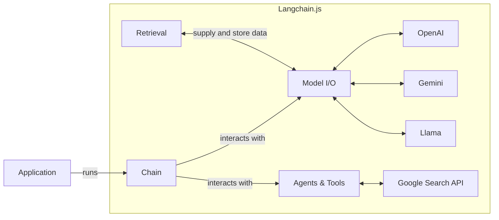

## Introduction

[Langchain.js](https://js.langchain.com/docs/get_started/introduction) is a framework to build applications on top of Large-Language Models (OpenAI, Llama, Gemeni).

Building on top of LLMs comes with many challenges:
- Gathering and preparing the data (context) and providing memory to models
- Orchestrating tasks to match LLM API requirements (ex: rate limiting, chunking)
- Parse the different LLM result format

Langchain comes with a set of high-level concepts and tools to cope with those challenges:
- [Retrieval modules](https://js.langchain.com/docs/modules/data_connection/data_connection/) such as [Document Loaders](https://js.langchain.com/docs/modules/data_connection/document_loaders/) or [Text splitter](https://js.langchain.com/docs/modules/data_connection/document_transformers/) help with gathering and preparing the data provided to the models
- [Model I/O](https://js.langchain.com/docs/modules/model_io/) is a set of tools that help to normalize the APIs across multiple models (_ex: Prompt Templates_)
- [Agents](https://js.langchain.com/docs/modules/agents/) and Tools help to build reasoning (_ex: how to answer based on provided context, what actions to take_)
- [Chains](https://js.langchain.com/docs/modules/chains/) help in orchestrating all the above



Browserbase provides a [Document Loader](https://js.langchain.com/docs/modules/data_connection/document_loaders/) to enable your Langchain application to browse the web to:
- Extract text or raw HTML, including from web pages using JavaScript or dynamically rendered text
- Load images via screenshots


## Add Browserbase to your Langchain application

<Steps titleSize="h3">
  <Step title="Get your API Key">
    Go over the [Dashboard's Settings tab](https://www.browserbase.com/settings):

    <Frame caption="Then copy your API Key directly from the input">
      
    </Frame>

  </Step>

  <Step title="Install the Browserbase SDK">

    ```bash
      npm i @browserbasehq/sdk
    ```

  </Step>

  <Step title="Load documents or images">

    **Load documents**

    ```ts
    import {
      BrowserbaseLoader
    } from "langchain/document_loaders/web/browserbase.js";

    const loader = new BrowserbaseLoader(
      ["https://example.com"],
      { textContent: true }
    );
    const docs = await loader.load();
    ```

    <Note>
      The default value `textContent: false` will return HTML as a LlamaIndex `Document`.
      Setting `textContent: true` will return LlamaIndex `Document` with text only.
    </Note>
  </Step>
</Steps>