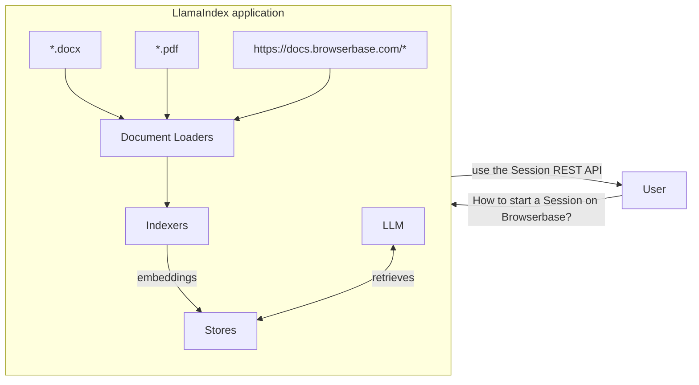

## Introduction

LlamaIndex is a framework for building search and retrieval LLM applications, such as asking questions over a large dataset or extracting information from complex datasets.

Combine a large and diversified set of data into a searchable experience requires a lot of work as you need to:
- support a wide range of data types (PDF, Images, Websites)
- orchestrate the transformation of a large dataset
- index large chunks of data in a searchable index (vector database)

LlamaIndex, with [LlamaHub](https://llamahub.ai/?tab=readers), provides a wide range of libraries and tools to load various document types.

Browserbase provides a `WebReader` Document loader to:
- Load web pages, including pages using JavaScript or dynamically rendered text.
- Load images via screenshots.

## Add Browserbase to your LlamaIndex application

<CardGroup cols={2}>
  <Card
    title="Browserbase for LlamaIndex (Python)"
    icon="book"
    iconType="light"
    href="/integrations/llama-index/python"
  >
    Add Browserbase `Document Loader` to your LlamaIndex application
  </Card>
</CardGroup>