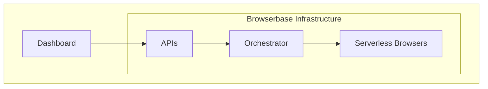

The Browserbase Platform is the solution to all the reliability, scalability,
and fingerprinting challenges that working with headless browsers brings. Let's
take a closer look at it:

## Dashboard

The Dashboard is the collaborative place to access real-time information to all
[Sessions](/sessions) and essential metrics.

[Session Replay](/session-replay) is the central feature, providing video
replay, logs, and other Chrome Devtools data for a specific Session.

<Frame caption="Session Replay gives you full visibility on a Session's run.">
  
</Frame>

<CardGroup cols={2}>

{" "}

<Card title="Quickstart" icon="book" iconType="light" href="/quickstart">
  Start your first Browser Session.
</Card>
<Card
  title="Session Replay"
  icon="book"
  iconType="light"
  href="/session-replay"
>
  Get the best of Session Replay
</Card>

</CardGroup>

## APIs and Orchestrator

Through the Orchestrator, Browserbase offers multiple public APIs
([Sessions API](/api-reference/sessions),
[Extensions API](/api-reference/extensions)), granting direct access to the
underlying Browser Sessions.

The Orchestrator is vital in:

- Maintaining the [Sessions's state](/session#sessions-lifecycle) by managing
  the Serverless infrastructure and resources allocation
- Capturing live session videos and Chrome Dev tools logs and network data used
  by the [Session Replay](/session-replay)

<CardGroup cols={2}>

{" "}

<Card
  title="Sessions' state"
  icon="book"
  iconType="light"
  href="/session#sessions-lifecycle"
>
  Learn more about Sessions's lifecycle
</Card>
<Card
  title="Sessions API"
  icon="server"
  iconType="light"
  href="/reference/session-api"
>
  Get full control of the Sessions
</Card>

</CardGroup>

## Serverless Browsers

All Sessions run on a custom Chromium with advanced Stealth capabilities and
performance improvements, removing cold starts.

[Browsers](/browsers) are powered by an autoscaled and secured architecture,
providing all the benefits of Serverless infrastructure with fine-grained
control of resources.

<CardGroup cols={2}>

{" "}

<Card title="Stealth mode" icon="book" iconType="light" href="/stealth-mode">
  Learn more about Stealth capabilities
</Card>
<Card title="Browsers" icon="server" iconType="light" href="/browsers">
  Explore our Browser features
</Card>

</CardGroup>
