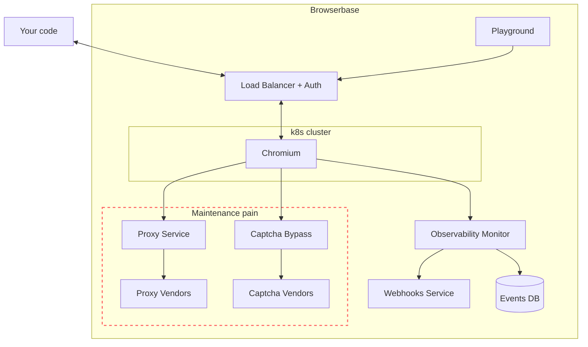

The Browserbase Platform is the solution to all the reliability, scalability,
and fingerprinting challenges that working with headless browsers brings. Let's
take a closer look at it:

_The Browserbase infrastructure handles all the heavy lifting of managing a
fleet of Browser instances and the maintenance burden of integrating with
reliable and up-to-date proxy and captcha solver providers._

## Dashboard

The Dashboard is a collaborative place to access real-time information from all
[Sessions](/features/sessions) and essential metrics.

[Session Debugger](/features/session-debugger) is a central feature, providing
video replay, logs, and other Chrome Devtools data for a specific Session.

<Frame caption="Session Debugger gives you full visibility on a Session's run.">
  
</Frame>

<CardGroup cols={2}>

{" "}

<Card title="Quickstart" icon="book" iconType="light" href="/quickstart">
  Start your first Browser Session.
</Card>
<Card
  title="Session Debugger"
  icon="book"
  iconType="light"
  href="/features/session-debugger"
>
  Get the best of Session Debugger
</Card>

</CardGroup>

## APIs and Orchestrator

Through the Orchestrator, Browserbase offers multiple public APIs
([Sessions API](/api-reference/list-all-sessions),
[Extensions API](/api-reference/upload-an-extension)), granting direct access to
the underlying Browser Sessions.

The Orchestrator is vital in:

- Maintaining the [Sessions's state](/features/sessions#sessions-lifecycle) by
  managing the Serverless infrastructure and resource allocation
- Capturing
  [Chrome DevTools Protocol](https://chromedevtools.github.io/devtools-protocol/)
  data, including logs and network data used by the
  [Session Debugger](/features/session-debugger)
- Recording live session using [rrweb](https://www.rrweb.io/) enabling
  introspectable replays

<CardGroup cols={2}>

{" "}

<Card
  title="Sessions' state"
  icon="book"
  iconType="light"
  href="/features/sessions#sessions-lifecycle"
>
  Learn more about Sessions's lifecycle
</Card>
<Card
  title="Sessions API"
  icon="server"
  iconType="light"
  href="/api-reference/list-all-sessions"
>
  Get full control of the Sessions
</Card>

</CardGroup>

## Serverless Browsers

All Sessions run on a custom Chromium with advanced Stealth capabilities and
performance improvements without cold starts.

[Browsers](/features/browsers) are powered by an autoscaled and secured
architecture, providing all the benefits of Serverless infrastructure with
fine-grained control of resources.

Each Browser Session runs in an isolated container with dedicated ressources,
network and a [new residential IP](/features/stealth-mode).

<CardGroup cols={2}>

{" "}

<Card
  title="Stealth mode"
  icon="book"
  iconType="light"
  href="/features/stealth-mode"
>
  Learn more about Stealth capabilities
</Card>
<Card title="Browsers" icon="server" iconType="light" href="/features/browsers">
  Explore our Browser features
</Card>

</CardGroup>
